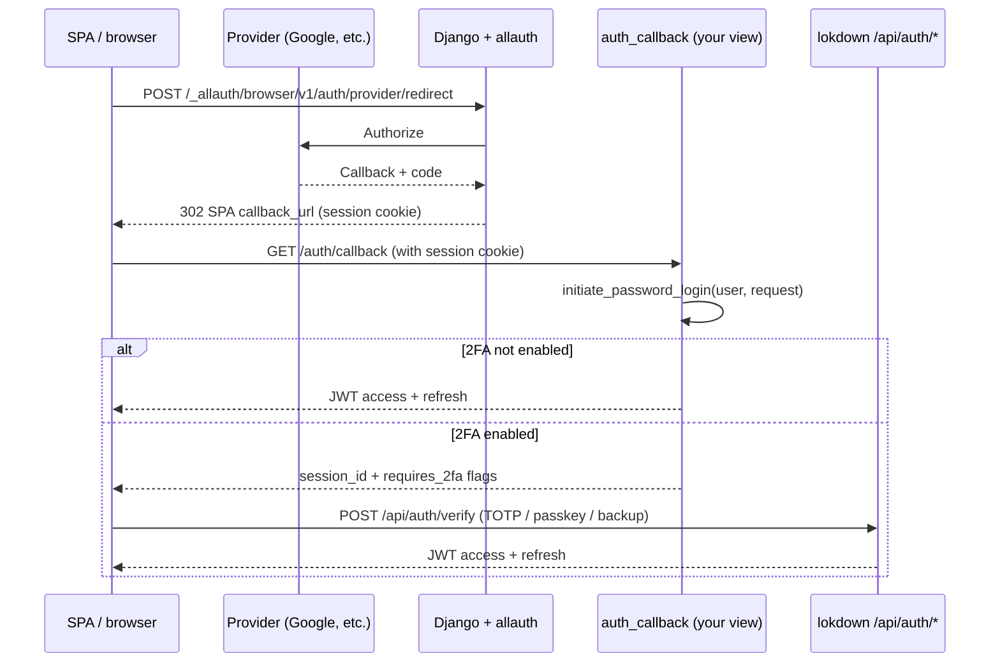
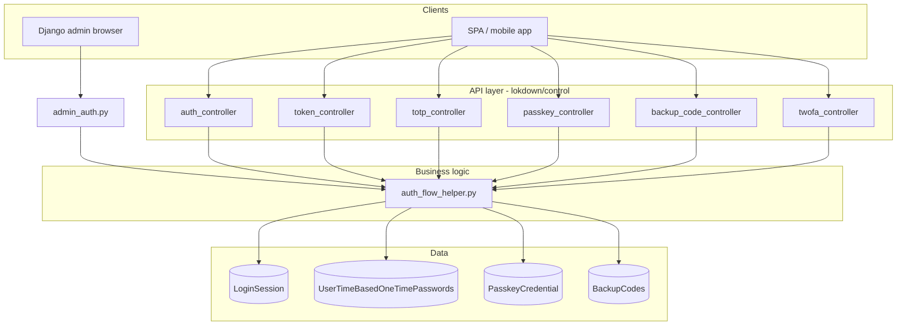
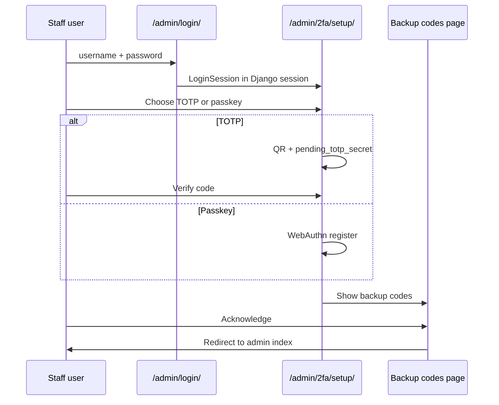

# Lokdown authentication workflow

This document describes how lokdown handles password login, two-factor authentication (2FA), JWT issuance, 2FA enrollment, optional user API keys, and Django admin integration after the control-layer refactor.

All business logic lives in `lokdown/helpers/auth_flow_helper.py`. HTTP handlers are thin controllers under `lokdown/control/`. Request and response shapes are defined in `lokdown/serializers/`.

---

## Concepts

### What counts as “2FA enabled”

A user has 2FA enabled when **either** TOTP or at least one passkey is configured:

- TOTP: `UserTimeBasedOneTimePasswords.totp_secret` is set
- Passkey: one or more `PasskeyCredential` rows exist

Backup codes alone do **not** enable 2FA. They are a recovery factor used only after a primary method exists.

### LoginSession

Pending logins (password OK, 2FA not yet done) use a `LoginSession` row:

| Field | Purpose |
|--------|---------|
| `session_id` | Opaque UUID returned to the client |
| `expires_at` | Short-lived (default `TWOFA_SESSION_TIMEOUT` minutes) |
| `requires_2fa` | Always true for these sessions |
| `challenge` | WebAuthn challenge (passkey login or passkey setup) |
| `is_authenticated` | Set true after JWT is issued; blocks reuse |
| `totp_verified` / `passkey_verified` | Set when that factor succeeds (backup does not set these) |

Sessions are single-use for token completion: once `is_authenticated` is true, verification endpoints reject the session.

### Two login stacks (same logic, different response keys)

| Stack | Step 1 | Step 2 | Token JSON keys |
|--------|--------|--------|-----------------|
| **REST login** | `POST /api/auth/login` | `POST /api/auth/verify` | `access_token`, `refresh_token` |
| **SimpleJWT** | `POST /api/auth/token` | `POST /api/auth/token/verify` | `access`, `refresh` |

Both call `initiate_password_login()` and `verify_second_factor()` in `auth_flow_helper.py`.

### External provider login (OAuth)

| Stack | Step 1 | Step 2 | Step 3 | Step 4 (if 2FA) | Token JSON keys |
|--------|--------|--------|--------|-----------------|-----------------|
| **OAuth + REST** | `GET /_allauth/browser/v1/config` or lokdown metadata → POST headless redirect | Browser OAuth (provider callbacks on `/accounts/…`) | `POST /api/auth/oauth/callback` (session + CSRF) | `POST /api/auth/verify` | `access_token`, `refresh_token` |
| **OAuth + SimpleJWT** | Same | Same | Same | `POST /api/auth/token/verify` | `access`, `refresh` |

Step 1–3 are documented in OpenAPI under the **OAuth** tag (`example/api_schema.json`). Allauth headless routes (`/_allauth/browser/v1/*`) and provider callbacks (`/accounts/<provider>/login/callback/`) are browser-only and do not appear in the lokdown schema.

OAuth completes with a **Django session** (`request.user`). Lokdown JWTs are issued at step 3 via `bridge_oauth_session_to_lokdown` / `initiate_password_login`. See [Login with external provider](#api-workflow-login-with-external-provider-oauth).

### Passkey login requires a challenge step

Passkey verification checks `LoginSession.challenge`. Before calling verify:

1. Complete password login → receive `session_id`
2. `POST /api/auth/2fa/passkey/options` with `session_id` → server stores challenge
3. Run WebAuthn `navigator.credentials.get()` in the browser
4. Submit `passkey_response` to verify

### User API keys (optional)

When `LOKDOWN_API_KEYS_ENABLED = True`, users can create **user-tied API keys** for machine-to-machine access to **your** protected endpoints. Keys:

- Are **hashed at rest** (Django password hasher); the plaintext key is returned **once** at creation
- Authenticate via `Authorization: Api-Key <key>` when `LokdownApiKeyAuthentication` is in `REST_FRAMEWORK["DEFAULT_AUTHENTICATION_CLASSES"]`
- Do **not** replace password login, OAuth, or JWT token endpoints — key management requires a JWT from password login

See [API workflow: user API keys](#api-workflow-user-api-keys).

---

## Project setup

### `settings.py`

```python
INSTALLED_APPS = [
    # ...
    "lokdown",
    "rest_framework",
    "rest_framework_simplejwt",
    "drf_spectacular",  # optional, for OpenAPI
]

# WebAuthn (required for passkeys)
WEBAUTHN_RP_ID = "localhost"          # fallback rpId; admin/API use request hostname when available
WEBAUTHN_RP_NAME = "My Application"
WEBAUTHN_ORIGINS = [
    "http://localhost:8000",
    "http://127.0.0.1:8000",
]
WEBAUTHN_ORIGIN = "http://localhost:8000"  # optional; first origin if ORIGINS unset

# 2FA behaviour
TWOFA_SESSION_TIMEOUT = 10            # minutes, pending LoginSession lifetime
BACKUP_CODE_RATE_LIMIT = 10           # attempts per IP per minute
BACKUP_CODES_COUNT = 8
BACKUP_CODE_LENGTH = 10
ADMIN_2FA_REQUIRED = True             # custom admin login + 2FA routes

# Optional user API keys (disabled by default)
LOKDOWN_API_KEYS_ENABLED = False
LOKDOWN_API_KEY_MAX_LIFESPAN_DAYS = None   # e.g. 365 to cap lifespan; None = no cap
LOKDOWN_API_KEY_ALLOW_INDEFINITE = True
LOKDOWN_API_KEY_PREFIX = "lk_"
LOKDOWN_API_KEY_AUTH_SCHEME = "Api-Key"

REST_FRAMEWORK = {
    "DEFAULT_AUTHENTICATION_CLASSES": [
        "rest_framework_simplejwt.authentication.JWTAuthentication",
        "lokdown.authentication.LokdownApiKeyAuthentication",  # optional; only when API keys enabled
    ],
}
```

### Root `urls.py`

```python
from django.urls import path, include
from lokdown.urls import override_admin_urls

urlpatterns = [
    path("admin/", admin.site.urls),
    path("api/", include("lokdown.urls")),
]

urlpatterns = override_admin_urls(urlpatterns)
```

`override_admin_urls()` replaces the project `admin/` include with lokdown admin routes (2FA login when `ADMIN_2FA_REQUIRED`, plus staff self-service setup URLs).

### Migrations

```bash
python manage.py migrate lokdown
```

If you enable social login (allauth in `INSTALLED_APPS`):

```bash
python manage.py migrate sites
```

---

## Social login (django-allauth)

Lokdown ships helpers around **django-allauth** so SPAs can use OAuth providers (Google, GitHub, Microsoft, etc.) alongside lokdown’s password + 2FA JWT APIs.

### Optional integration

Social login is **optional**. You only need the steps below if you want OAuth in your project.

| Scenario | What to do |
|----------|------------|
| Password + 2FA JWT only | Add `lokdown` only. Do **not** add allauth apps or `SOCIALACCOUNT_PROVIDERS`. |
| OAuth + lokdown | Follow **Install and apps** below. |

**Without allauth in `INSTALLED_APPS`:**

- `python manage.py check` runs normally (no allauth import during lokdown checks).
- Lokdown JWT and 2FA APIs work unchanged.
- Omit allauth entirely if you only need password + JWT APIs.

**With allauth configured:** mount URLs, middleware, and Social applications in Django admin (see [README.md — Social login](../README.md#social-login-oauth)).

Social login establishes a **Django session** via allauth. Your SPA or `GET /api/auth/oauth/callback` (with session cookie) exchanges that session for lokdown JWTs. An optional dev-only HTML route (`/auth/callback`) exists in the example project.

### Install and apps

`django-allauth[headless]` is installed with `django-lokdown`. You must also add allauth to **`INSTALLED_APPS`** in your project:

```python
from lokdown.socialauth.settings_helper import (
    LOKDOWN_ALLAUTH_BASE_APPS,
    get_allauth_recommended_settings,
    get_lokdown_socialauth_middleware,
    get_provider_installed_apps,
)

INSTALLED_APPS = [
    # ...
    "lokdown",
    *LOKDOWN_ALLAUTH_BASE_APPS,
    *get_provider_installed_apps(["google", "github"]),  # only providers you enable
]

# Merge recommended defaults (adapter, backends, SITE_ID, email settings)
globals().update(get_allauth_recommended_settings())

SITE_ID = 1

LOKDOWN_SOCIALAUTH_ENABLED_PROVIDERS = ["google", "github"]

# Provider-specific options only — client id/secret live in admin SocialApp records.
SOCIALACCOUNT_PROVIDERS = {
    "github": {"VERIFIED_EMAIL": True},
}
```

Alternatively, you may embed credentials in settings with ``APPS``/``APP`` under each provider (useful for tests or twelve-factor deploys). When any provider uses ``APPS``/``APP``, ``LOKDOWN_SOCIALAUTH_ENABLED_PROVIDERS`` is returned as-is.

### Social application credentials (admin)

For production and the example dev project, configure OAuth apps in Django admin instead of environment variables:

1. Run migrations: ``python manage.py migrate`` (includes ``sites`` and ``socialaccount``).
2. Open **Admin → Social applications** (`/admin/socialaccount/socialapp/`).
3. Add a **Social application** per provider (Provider: Google, GitHub, …).
4. Set **Client id** and **Secret key** from your provider console.
5. Under **Sites**, select the site matching ``SITE_ID`` (default: ``example.com``).

Lokdown lists only providers that have a linked ``SocialApp`` when no ``APPS``/``APP`` entries exist in ``SOCIALACCOUNT_PROVIDERS``. Register redirect URIs in each provider console, for example:

| Provider | Callback URL |
|----------|--------------|
| Google | `https://your-domain/accounts/google/login/callback/` |
| GitHub | `https://your-domain/accounts/github/login/callback/` |

```python
MIDDLEWARE = [
    # ...
    *get_lokdown_socialauth_middleware(),
]
```

`get_lokdown_socialauth_middleware()` returns, in order:

1. `allauth.account.middleware.AccountMiddleware` (required by django-allauth)
2. `RedirectAuthenticatedSocialLoginMiddleware`
3. `AutoRedirectAccountLoginToSocialMiddleware`

### CustomSocialAccountAdapter

Set in recommended settings as `SOCIALACCOUNT_ADAPTER = "lokdown.socialauth.adapters.CustomSocialAccountAdapter"`.

On social signup, `populate_user()` sets `username` from the provider email (truncated to 150 characters). If that username exists, it appends `_1`, `_2`, etc. Import from:

```python
from lokdown.socialauth.adapters import CustomSocialAccountAdapter
# or: from lokdown.socialauth import CustomSocialAccountAdapter  # lazy import
```

Middleware and adapter classes use **lazy imports** in `lokdown.socialauth` so projects without allauth in `INSTALLED_APPS` do not load allauth at startup. Settings helpers (`lokdown.socialauth.settings_helper`) are safe to import anytime.

### URLs

```python
from django.urls import path, include
from lokdown.socialauth.urls import get_allauth_urlpatterns
from lokdown.socialauth.settings_helper import get_headless_frontend_urls
from lokdown.urls import override_admin_urls

urlpatterns = [
    *get_allauth_urlpatterns(),  # /accounts/ callbacks + /_allauth/ headless API
    path("api/", include("lokdown.urls")),
    path("auth/callback", your_jwt_callback_view, name="auth_callback"),
]

HEADLESS_FRONTEND_URLS = get_headless_frontend_urls("https://app.example.com")

urlpatterns = override_admin_urls(urlpatterns)
```

With ``HEADLESS_ONLY = True`` (included in ``get_allauth_recommended_settings()``), the SPA starts OAuth via allauth headless — not ``/accounts/<provider>/login/``:

| Step | Endpoint |
|------|----------|
| Discover providers | `GET /_allauth/browser/v1/config` |
| Start OAuth | `POST /_allauth/browser/v1/auth/provider/redirect` (form submit) |
| Provider callback | `/accounts/<provider>/login/callback/` (Django only) |

### Lokdown middleware

| Middleware | Purpose |
|------------|---------|
| `RedirectAuthenticatedSocialLoginMiddleware` | If the user is already signed in, skip OAuth when hitting `/accounts/<provider>/login/?next=...` (SPA retries). Honors `process=connect` for account linking. |
| `AutoRedirectAccountLoginToSocialMiddleware` | When enabled, `GET /accounts/login/` redirects to a provider instead of the email form. |

Settings:

| Setting | Description |
|---------|-------------|
| `SOCIALACCOUNT_LOGIN_AUTO_REDIRECT_PROVIDER` | Provider id for auto-redirect (e.g. `"google"`). |
| `SOCIALACCOUNT_LOGIN_AUTO_REDIRECT_GOOGLE` | Legacy bool; equivalent to provider `"google"`. |
| `LOKDOWN_SOCIALAUTH_CALLBACK_URL_NAME` | URL name when `?callback_url=` is absent (default `auth_callback`). |
| `LOKDOWN_SOCIALAUTH_ALLOWED_CALLBACK_ORIGINS` | Allowlist of SPA origins (e.g. `http://localhost:5173`). API host origin is always allowed. |
| `LOKDOWN_SOCIALAUTH_ENABLED_PROVIDERS` | Optional explicit list for middleware path matching. |
| `LOKDOWN_SOCIALAUTH_ACCOUNT_URL_PREFIX` | URL prefix if not `accounts` (default `accounts`). |

Opt out of auto-redirect to see the local login form: `GET /accounts/login/?local=1` (also `?password=` or `?email=`).

### System checks

Lokdown registers two social-auth checks (`lokdown.W003`, `lokdown.W004`). They run **only when both** are true:

1. `"allauth"` is in `INSTALLED_APPS`
2. At least one provider is configured (`SOCIALACCOUNT_PROVIDERS` with `APPS`/`APP`, non-empty `LOKDOWN_SOCIALAUTH_ENABLED_PROVIDERS`, or admin `SocialApp` records)

| Check ID | Condition warned |
|----------|------------------|
| `lokdown.W003` | `SITE_ID` is not set |
| `lokdown.W004` | `SOCIALACCOUNT_ADAPTER` is not `lokdown.socialauth.adapters.CustomSocialAccountAdapter` |

If you have `SOCIALACCOUNT_PROVIDERS` in settings but forgot to add allauth apps, checks are **skipped** (no crash on `manage.py check`).

Verify after setup:

```bash
python manage.py check
python manage.py migrate sites
```

### OpenAPI / Swagger (`api_schema.json`)

Lokdown registers **DRF** OAuth helpers in [drf-spectacular](https://drf-spectacular.readthedocs.io/). They appear in Swagger UI and in a checked-in schema file in the example project.

| What appears in OpenAPI | What does not |
|-------------------------|---------------|
| `GET /api/auth/oauth/providers` | `GET /_allauth/browser/v1/config` (allauth headless) |
| `GET /api/auth/oauth/{provider}/login` | `POST /_allauth/browser/v1/auth/provider/redirect` |
| `POST /api/auth/oauth/callback` (JSON, SPA bridge) | `/accounts/*/login/callback/` and optional HTML `/auth/callback` |

**Regenerate** (from your Django project root, with `drf_spectacular` installed):

```bash
python manage.py spectacular --file api_schema.json
```

Example project:

```bash
cd example
python manage.py spectacular --file api_schema.json
# View: http://127.0.0.1:8000/api/schema/swagger-ui/
```

**OpenAPI components** (in `components.schemas`):

| Schema | Used by |
|--------|---------|
| `OAuthProvidersResponse` | `GET auth/oauth/providers` |
| `OAuthLoginUrlResponse` | `GET auth/oauth/{provider}/login` |
| `OAuthSessionBridgeResponse` | `GET auth/oauth/callback` |

Implementation: `lokdown/control/socialauth_controller.py`, serializers in `lokdown/serializers/socialauth.py`.

---

## API workflow: login with external provider (OAuth)

This section describes the **end-to-end path** from Google/GitHub/etc. to lokdown JWTs, including 2FA.

### Two layers of authentication

| Layer | Established by | Used for |
|-------|----------------|----------|
| **Django session** | django-allauth after OAuth | Browser cookie; `request.user` in views |
| **Lokdown JWT** | `initiate_password_login` + optional `verify_second_factor` | `Authorization: Bearer` on `/api/*` |

Lokdown does not expose a dedicated “OAuth token” endpoint. After OAuth, your **`auth_callback`** view (or an API called with session cookies) must call the same helpers as password login.

### Overview



### Step 1 — Start OAuth (browser)

**Option A — allauth headless** (recommended for SPAs):

```http
GET /_allauth/browser/v1/config
```

Returns configured providers (id, name, supported flows). Then POST a **synchronous HTML form** (not XHR) to start OAuth:

```html
<form method="post" action="/_allauth/browser/v1/auth/provider/redirect">
  <input type="hidden" name="provider" value="google" />
  <input type="hidden" name="callback_url" value="http://localhost:5173/oauth/callback" />
  <input type="hidden" name="process" value="login" />
  <input type="hidden" name="csrfmiddlewaretoken" value="..." />
  <button type="submit">Continue with Google</button>
</form>
```

**Option B — lokdown OpenAPI helper** (pre-fills `callback_url`):

```http
GET /api/auth/oauth/google/login?callback_url=http://localhost:5173/oauth/callback
```

**200 response**

```json
{
  "provider": "google",
  "redirect_url": "http://127.0.0.1:8000/_allauth/browser/v1/auth/provider/redirect",
  "callback_url": "http://localhost:5173/oauth/callback",
  "redirect_method": "POST"
}
```

Build a form POST to `redirect_url` with `provider`, `callback_url`, `process=login`, and `csrfmiddlewaretoken`. The legacy `?next=` query param is still accepted as an alias for `callback_url`.

### Step 2 — OAuth completes (allauth)

Allauth:

1. Creates or loads a `User` (new signups get `username` from email via `CustomSocialAccountAdapter`).
2. Links a `SocialAccount` row to the provider.
3. Calls Django `login()` and sets the **session cookie**.
4. Redirects to `next` (e.g. `/auth/callback`).

No lokdown `LoginSession` or JWT exists yet.

### Step 3 — Bridge session to lokdown

Call **`GET /api/auth/oauth/callback`** with the **session cookie** from OAuth (documented in Swagger under tag **OAuth**).

Or implement a browser view at `auth_callback` that calls the same logic (`bridge_oauth_session_to_lokdown` / `initiate_password_login`). It does **not** re-check a password; it only tests whether lokdown 2FA is enabled:

```http
GET /api/auth/oauth/callback
Cookie: sessionid=...
```

**Example `auth_callback` view** (HTML for local dev):

```python
from django.http import JsonResponse
from django.shortcuts import redirect
from django.contrib.auth.decorators import login_required

from lokdown.helpers.auth_flow_helper import initiate_password_login


@login_required
def auth_callback(request):
    try:
        payload = initiate_password_login(request.user, request)
    except RuntimeError:
        return JsonResponse({"error": "Failed to create authentication session"}, status=500)

    if payload.get("requires_2fa"):
        # Option A: SPA — redirect with session_id in query (hash or search)
        return redirect(f"/app/2fa?session_id={payload['session_id']}")
        # Option B: JSON API — return payload for XHR/fetch (ensure CORS + credentials)
        # return JsonResponse(payload)

    # No 2FA — return or store JWTs
    return redirect(
        f"/app/home#access_token={payload['access_token']}&refresh_token={payload['refresh_token']}"
    )
    # Prefer HttpOnly cookies or a secure backend-for-frontend over URL fragments in production.
```

**200-equivalent payloads** (same shape as `POST /api/auth/login`):

**No 2FA**

```json
{
  "access_token": "<jwt>",
  "refresh_token": "<jwt>",
  "requires_2fa": false
}
```

**2FA required**

```json
{
  "session_id": "550e8400-e29b-41d4-a716-446655440000",
  "requires_2fa": true,
  "totp_enabled": true,
  "passkey_enabled": true,
  "backup_codes_available": true
}
```

### Step 4 — Complete 2FA (if required)

Identical to [login with 2FA](#api-workflow-login-with-2fa). The `session_id` from step 3 is a lokdown `LoginSession`, not the Django session id.

```http
POST /api/auth/verify
Content-Type: application/json

{
  "session_id": "<from callback>",
  "totp_token": "123456"
}
```

Passkey flow still requires `POST /api/auth/2fa/passkey/options` before verify. Use `POST /api/auth/token/verify` if your app uses the SimpleJWT key names (`access` / `refresh`).

### Decision matrix

| User state | After OAuth | Callback (`initiate_password_login`) | Client next step |
|------------|-------------|-----------------------------------|------------------|
| New user, no 2FA | Django session | JWT immediately | Store tokens; call `/api/*` |
| New user, 2FA enabled* | Django session | `session_id` + flags | Run 2FA verify flow |
| Returning user, no 2FA | Django session | JWT immediately | Store tokens |
| Returning user, 2FA on | Django session | `session_id` + flags | Run 2FA verify flow |
| Already logged in (SPA retry) | Session exists | Middleware → `next` without OAuth | Run callback bridge again |

\*2FA is only required if TOTP or passkeys were already enrolled; new OAuth users typically have neither until they enroll via authenticated `/api/auth/2fa/*` routes.

### New signup vs returning login

| Event | What happens |
|-------|----------------|
| **First OAuth login** | allauth creates `User`; adapter sets `username` from email; `SocialAccount` created |
| **Repeat OAuth login** | allauth matches existing `SocialAccount` / email; same `User` gets Django session |
| **Email already exists (local account)** | Controlled by allauth settings (`SOCIALACCOUNT_EMAIL_AUTHENTICATION`, etc. in `get_allauth_recommended_settings()`) — may auto-connect or require account pairing per your allauth config |

### Account linking (`process=connect`)

For logged-in users adding another provider:

```text
GET /accounts/github/login/?process=connect&next=/settings/accounts
```

Do **not** run the JWT bridge on `connect` completion unless the product flow requires it; the user is already authenticated. Lokdown middleware intentionally does not short-circuit these requests.

### SPA-only frontend (no Django HTML templates)

Use this when your React/Vue/etc. app owns the login UI. With `HEADLESS_ONLY = True`, Django serves provider OAuth callbacks and the headless API only — no allauth HTML login pages.

**Keep on Django**

| Route | Purpose |
|-------|---------|
| `/_allauth/browser/v1/config` | Provider discovery |
| `/_allauth/browser/v1/auth/provider/redirect` | OAuth start (POST form) |
| `/accounts/<provider>/login/callback/` | Provider callback (redirect only) |
| `/api/auth/oauth/callback` | Bridge Django session → lokdown JWT |

**Remove or skip in your app**

- Django login/signup HTML templates
- `/accounts/login/` links in your UI
- Optional dev-only `/auth/callback` HTML pages

**Same-origin via Vite proxy (recommended)**

Proxy `/_allauth`, `/accounts`, and `/api` to Django. Leave the API base empty; use relative URLs on one host only (`http://localhost:5173`). `GET /api/auth/oauth/callback` authenticates via the Django **session cookie** (`sessionid`), not Bearer JWT.

Provider redirect URIs in Google/GitHub consoles use the **API host** (Django), e.g. `http://localhost:8000/accounts/google/login/callback/`. Restart Vite after proxy changes.

```javascript
// vite.config.js
proxy: {
  "/api": "http://localhost:8000",
  "/accounts": "http://localhost:8000",
  "/_allauth": "http://localhost:8000",
}
```

```javascript
function postForm(action, fields) {
  const form = document.createElement("form");
  form.method = "POST";
  form.action = action;
  Object.entries(fields).forEach(([name, value]) => {
    const input = document.createElement("input");
    input.type = "hidden";
    input.name = name;
    input.value = value;
    form.appendChild(input);
  });
  document.body.appendChild(form);
  form.submit();
}

// Discover providers from allauth headless
const config = await fetch("/_allauth/browser/v1/config").then((r) => r.json());
const providers = config.data.socialaccount.providers;

// Start OAuth (synchronous form POST — not fetch/XHR)
postForm("/_allauth/browser/v1/auth/provider/redirect", {
  provider: "google",
  callback_url: `${window.location.origin}/oauth/callback`,
  process: "login",
  csrfmiddlewaretoken: document.cookie.match(/csrftoken=([^;]+)/)?.[1] ?? "",
});

// SPA callback route (/oauth/callback)
const payload = await fetch("/api/auth/oauth/callback", {
  credentials: "include",
}).then((r) => r.json());
```

**Frontend flow**

1. `GET /_allauth/browser/v1/config` (or `GET /api/auth/oauth/providers` for lokdown metadata)
2. POST form to `/_allauth/browser/v1/auth/provider/redirect`
3. After OAuth, allauth redirects to your SPA `callback_url`
4. `GET /api/auth/oauth/callback` with `credentials: 'include'` to obtain JWTs
5. If `requires_2fa`, `POST /api/auth/verify` with `session_id`

**Cross-origin SPA settings** (when API and UI are on different hosts)

```python
SOCIALACCOUNT_LOGIN_ON_GET = True  # skip allauth confirmation page

CSRF_TRUSTED_ORIGINS = [
    "http://localhost:5173",
    "http://localhost:8000",
]

CORS_ALLOWED_ORIGINS = [
    "http://localhost:5173",
]
CORS_ALLOW_CREDENTIALS = True
# Do not use CORS_ALLOW_ALL_ORIGINS=True with credentials
```

POST requests from the SPA must include `X-CSRFToken` (read `csrftoken` cookie from a prior GET).

The example project documents local dev defaults in [README.md — Local development](../README.md#local-development-example-project).

### SPA implementation patterns

| Pattern | OAuth start | Callback | 2FA |
|---------|-------------|----------|-----|
| **SPA + headless (recommended)** | POST `/_allauth/browser/v1/auth/provider/redirect` with `callback_url` | SPA route calls `GET /api/auth/oauth/callback` | `POST /api/auth/verify` with `session_id` |
| **Lokdown metadata helper** | `GET /api/auth/oauth/{provider}/login?callback_url=<spa-url>` → build form POST | Same | Same |
| **Popup + callback page** | Popup opens provider URL; callback page `postMessage` to opener | Callback page reads session via server render | Opener calls `/api/auth/verify` |
| **BFF** | Same | Callback sets HttpOnly cookies server-side | BFF proxies verify |

Requirements:

- Callback and OAuth URLs must be **same-site** (or configured CSRF/trusted origins) so the session cookie is sent.
- For `fetch` to `/api/auth/verify` after OAuth, use `credentials: 'include'` only if your API shares session cookies; otherwise pass `session_id` in JSON from the callback response (common for SPAs on another origin).
- Use `/auth/callback` or `/oauth/callback` only for local dev; production SPAs should use `/api/auth/oauth/callback`.

### What not to do

- Do not call `POST /api/auth/login` with an empty or dummy password after OAuth — password auth is separate.
- Do not treat the Django session id as lokdown’s `session_id`; they are different systems.
- Do not skip the callback bridge if the SPA needs JWTs — allauth alone does not return lokdown tokens.

### Provider entry points (quick reference)

| Provider | Start login | URL name |
|----------|-------------|----------|
| Google | `/accounts/google/login/?next=/auth/callback` | `google_login` |
| GitHub | `/accounts/github/login/?next=/auth/callback` | `github_login` |
| Microsoft | `/accounts/microsoft/login/?next=/auth/callback` | `microsoft_login` |

Auto-redirect from account login (optional): set `SOCIALACCOUNT_LOGIN_AUTO_REDIRECT_PROVIDER = "google"` so `GET /accounts/login/` goes straight to Google unless `?local=1`.

---

## Architecture



---

## API workflow: login without 2FA

User has no TOTP secret and no passkeys.

```http
POST /api/auth/login
Content-Type: application/json

{"username": "jane", "password": "secret"}
```

**200 response**

```json
{
  "access_token": "<jwt>",
  "refresh_token": "<jwt>",
  "requires_2fa": false
}
```

Use `Authorization: Bearer <access_token>` on protected routes.

**SimpleJWT equivalent:** `POST /api/auth/token` with the same body returns `access` / `refresh` immediately when 2FA is off.

---

## API workflow: login with 2FA

### Step 1 — Password

```http
POST /api/auth/login
Content-Type: application/json

{"username": "jane", "password": "secret"}
```

**200 response** (2FA required)

```json
{
  "session_id": "550e8400-e29b-41d4-a716-446655440000",
  "requires_2fa": true,
  "totp_enabled": true,
  "passkey_enabled": true,
  "backup_codes_available": true
}
```

Use the flags to show only supported second-factor options in the UI.

**SimpleJWT:** `POST /api/auth/token` returns **401** with the same pre-2FA body when 2FA is required (not an error in the usual sense—check `requires_2fa` in the JSON).

### Step 2a — Complete with TOTP

```http
POST /api/auth/verify
Content-Type: application/json

{
  "session_id": "550e8400-e29b-41d4-a716-446655440000",
  "totp_token": "123456"
}
```

**200 response**

```json
{
  "access_token": "<jwt>",
  "refresh_token": "<jwt>",
  "requires_2fa": false
}
```

### Step 2b — Complete with passkey

**2b.1 — Fetch authentication options**

```http
POST /api/auth/2fa/passkey/options
Content-Type: application/json

{"session_id": "550e8400-e29b-41d4-a716-446655440000"}
```

**200 response** (abbreviated)

```json
{
  "challenge": "<base64>",
  "rp_id": "localhost",
  "timeout": 60000,
  "options": { }
}
```

**2b.2 — Browser WebAuthn** — call `navigator.credentials.get()` using `options` (or challenge/rpId).

**2b.3 — Verify**

```http
POST /api/auth/verify
Content-Type: application/json

{
  "session_id": "550e8400-e29b-41d4-a716-446655440000",
  "passkey_response": { }
}
```

`passkey_response` is the JSON-serialized `PublicKeyCredential` from the browser.

### Step 2c — Complete with backup code

Either include `backup_code` on `POST /api/auth/verify`, or use the dedicated endpoint:

```http
POST /api/auth/2fa/verify/backup
Content-Type: application/json

{
  "session_id": "550e8400-e29b-41d4-a716-446655440000",
  "backup_code": "ABCD1234EF"
}
```

**200 response**

```json
{
  "access_token": "<jwt>",
  "refresh_token": "<jwt>",
  "requires_2fa": false,
  "message": "Backup code verified successfully"
}
```

Backup codes are **single-use**. Failed attempts are logged (`FailedBackupCodeAttempt`) and rate-limited per IP (`BACKUP_CODE_RATE_LIMIT` per minute).

**JWT completion:** Same bodies for step 2, but use `POST /api/auth/token/verify` and expect `access` / `refresh` in the response.

---

## API workflow: enroll 2FA (authenticated user)

All setup endpoints require `Authorization: Bearer <access_token>`. Enrollment applies to **the authenticated user** (no `user_id` in the body).

### Enroll TOTP

**1. Start setup**

```http
POST /api/auth/2fa/setup/totp
Authorization: Bearer <access_token>
```

**200 response**

```json
{
  "secret": "BASE32SECRET",
  "qr_code": "<base64 png>",
  "provisioning_uri": "otpauth://totp/..."
}
```

Show the QR code or provisioning URI. The secret is stored **server-side** as a pending value until verification succeeds.

**2. Confirm**

```http
POST /api/auth/2fa/verify/totp
Authorization: Bearer <access_token>
Content-Type: application/json

{
  "totp_token": "123456"
}
```

**200 response**

```json
{
  "message": "TOTP setup verified successfully",
  "backup_codes": ["ABCD1234EF", "GHI5678JKL0"]
}
```

On success, lokdown saves the secret and generates a **new** set of backup codes. Save them immediately; they are not returned again via the API.

### Enroll passkey

**1. Start registration**

```http
POST /api/auth/2fa/passkey/setup
Authorization: Bearer <access_token>
```

**200 response**

```json
{
  "session_id": "<uuid>",
  "options": { }
}
```

**2. Browser WebAuthn** — `navigator.credentials.create()` with `options`.

**3. Complete registration**

```http
POST /api/auth/2fa/passkey/verify
Authorization: Bearer <access_token>
Content-Type: application/json

{
  "session_id": "<uuid from step 1>",
  "passkey_response": { }
}
```

**200 response**

```json
{
  "message": "Passkey setup verified successfully",
  "backup_codes": ["ABCD1234EF", "GHI5678JKL0"]
}
```

The credential is saved after verification. A fresh set of backup codes is generated and returned in the response (same as TOTP setup). Store them immediately; they are not returned again via the API.

### Manage passkeys

| Method | Path | Auth | Description |
|--------|------|------|-------------|
| GET | `/api/auth/2fa/passkey/credentials` | Yes | List credentials |
| DELETE | `/api/auth/2fa/passkey/remove?credential_id=...` | Yes | Remove one credential |

---

## API workflow: 2FA status and disable

### Status

```http
GET /api/auth/2fa/status
Authorization: Bearer <access_token>
```

**200 response**

```json
{
  "is_enabled": true,
  "totp_enabled": true,
  "passkey_enabled": false
}
```

### Disable all 2FA

```http
POST /api/auth/2fa/disable
Authorization: Bearer <access_token>
```

Clears TOTP secret, deletes all passkeys, and empties backup codes.

---

## API workflow: user API keys

User API keys are **optional** and **disabled by default** (`LOKDOWN_API_KEYS_ENABLED = False`). Enable them when you need machine-to-machine auth alongside JWT.

### What API keys are (and are not)

| API keys **are** | API keys **are not** |
|------------------|----------------------|
| An additional auth mechanism for your protected DRF views | A replacement for password login |
| Tied to a single Django `User` | Usable to obtain JWTs from `/auth/token` or `/auth/login` |
| Hashed at rest; shown once at creation | Retrievable after creation |
| Revocable and optionally expiring | Session cookies or refresh tokens |

Key management endpoints (`GET`/`POST /api/auth/api-keys`, `DELETE /api/auth/api-keys/<id>`) require **JWT authentication** (password login). API keys authenticate **your application’s** endpoints once you add `LokdownApiKeyAuthentication` to DRF settings.

### Enable

```python
LOKDOWN_API_KEYS_ENABLED = True
LOKDOWN_API_KEY_MAX_LIFESPAN_DAYS = 365   # optional upper bound in days; None = no cap
LOKDOWN_API_KEY_ALLOW_INDEFINITE = True   # False → every create must include expires_in_days

REST_FRAMEWORK = {
    "DEFAULT_AUTHENTICATION_CLASSES": [
        "rest_framework_simplejwt.authentication.JWTAuthentication",
        "lokdown.authentication.LokdownApiKeyAuthentication",
    ],
}
```

### Create a key

**`POST /api/auth/api-keys`** — JWT required. Returns the full key **once**.

```http
POST /api/auth/api-keys
Authorization: Bearer <jwt>
Content-Type: application/json

{"name": "CI deploy", "expires_in_days": 90}
```

Omit `expires_in_days` for an indefinite key when `LOKDOWN_API_KEY_ALLOW_INDEFINITE` is `True`.

**201**

```json
{
  "id": 1,
  "name": "CI deploy",
  "prefix": "lk_a1b2c3d4",
  "api_key": "lk_a1b2c3d4.<secret>",
  "created_at": "2026-06-06T12:00:00Z",
  "expires_at": "2026-09-04T12:00:00Z"
}
```

**400** — expiry in the past, exceeds `LOKDOWN_API_KEY_MAX_LIFESPAN_DAYS`, or indefinite keys disabled.

**403** — `LOKDOWN_API_KEYS_ENABLED` is `False`.

### List keys (metadata only)

**`GET /api/auth/api-keys`** — JWT required.

**200**

```json
{
  "api_keys": [
    {
      "id": 1,
      "name": "CI deploy",
      "prefix": "lk_a1b2c3d4",
      "created_at": "2026-06-06T12:00:00Z",
      "last_used_at": "2026-06-06T14:30:00Z",
      "expires_at": "2026-09-04T12:00:00Z",
      "is_active": true
    }
  ]
}
```

The `api_key` field is **never** included in list responses.

### Revoke a key

**`DELETE /api/auth/api-keys/{key_id}`** — JWT required.

**200**

```json
{"message": "API key revoked"}
```

**404** — key not found or already revoked.

### Authenticate with an API key

On any view using `IsAuthenticated`, send:

```http
Authorization: Api-Key lk_a1b2c3d4.<secret>
```

`LokdownApiKeyAuthentication` resolves the owning user and sets `request.user`. `last_used_at` is updated on each successful authentication.

Invalid, expired, or revoked keys return **401** with `"Invalid or expired API key"`.

When `LOKDOWN_API_KEYS_ENABLED` is `False`, the authentication class is a no-op (returns `None`) so JWT-only projects are unaffected.

### Lifespan rules

| Setting | Effect |
|---------|--------|
| `LOKDOWN_API_KEY_MAX_LIFESPAN_DAYS = 365` | `expires_in_days` cannot exceed 365 |
| `LOKDOWN_API_KEY_MAX_LIFESPAN_DAYS = None` | No upper bound from settings |
| `LOKDOWN_API_KEY_ALLOW_INDEFINITE = True` | Omit `expires_in_days` for keys that never expire |
| `LOKDOWN_API_KEY_ALLOW_INDEFINITE = False` | Every create must include `expires_in_days` |

---

## Django admin workflow

When `ADMIN_2FA_REQUIRED = True`, staff use lokdown’s admin routes under `/admin/` (via `override_admin_urls`).

### First login (no 2FA configured yet)



| Step | URL | Notes |
|------|-----|--------|
| Login | `/admin/login/` | Password only; creates `LoginSession`, stores `admin_2fa_session_id` in Django session |
| Setup hub | `/admin/2fa/setup/` | Choose TOTP or passkey |
| TOTP setup | `/admin/2fa/verify/totp/` | Secret in session until verified |
| Passkey setup | `/admin/2fa/setup/passkey/` | Uses same helpers as API |
| Backup codes | `/admin/2fa/backup-codes/` | Shown after first enrollment |

### Subsequent logins (2FA already enabled)

| Step | URL | Notes |
|------|-----|--------|
| Login | `/admin/login/` | Password → redirect to verify |
| Verify | `/admin/2fa/verify/` | TOTP, passkey, or backup code |
| Passkey challenge | `POST /api/auth/admin/2fa/passkey/options` | Called from verify template (Django session cookie); stores challenge on `LoginSession` |

On success, lokdown calls Django `login()` with the **model backend** explicitly (required when `AUTHENTICATION_BACKENDS` includes allauth) and clears `admin_2fa_session_id`.

### Staff self-service (already logged into admin)

Available even when `ADMIN_2FA_REQUIRED` is false:

| URL | Purpose |
|-----|---------|
| `/admin/current-user/totp-setup/` | Add/replace TOTP |
| `/admin/current-user/passkey-setup/` | Add passkey |
| `/admin/current-user/backup-codes/` | View codes after setup |

---

## Endpoint reference

Base path assumes `path("api/", include("lokdown.urls"))`.

### Authentication

| Method | Path | Auth | Description |
|--------|------|------|-------------|
| POST | `auth/login` | No | Password login → tokens or pre-2FA session |
| POST | `auth/verify` | No | Complete 2FA → `access_token` / `refresh_token` |
| POST | `auth/token` | No | SimpleJWT obtain (same semantics as login) |
| POST | `auth/token/refresh` | No | Refresh JWT |
| POST | `auth/token/verify` | No | Complete 2FA → `access` / `refresh` |

### 2FA enrollment & management

| Method | Path | Auth | Description |
|--------|------|------|-------------|
| POST | `auth/2fa/setup/totp` | Yes | Generate secret + QR |
| POST | `auth/2fa/verify/totp` | Yes | Confirm TOTP + create backup codes |
| POST | `auth/2fa/passkey/setup` | Yes | WebAuthn registration options |
| POST | `auth/2fa/passkey/verify` | Yes | Complete passkey registration |
| POST | `auth/2fa/passkey/options` | No | Passkey auth options (login session) |
| GET | `auth/2fa/passkey/credentials` | Yes | List passkeys |
| DELETE | `auth/2fa/passkey/remove` | Yes | Remove passkey (`?credential_id=`) |
| POST | `auth/2fa/verify/backup` | No | Login with backup code + tokens |
| GET | `auth/2fa/status` | Yes | 2FA status |
| POST | `auth/2fa/disable` | Yes | Remove all 2FA |

### User API keys

Documented in OpenAPI under the **API Keys** tag. Requires `LOKDOWN_API_KEYS_ENABLED = True`. Management endpoints require JWT; using keys on your endpoints requires `LokdownApiKeyAuthentication` in DRF settings.

| Method | Path | Auth | Description |
|--------|------|------|-------------|
| GET | `auth/api-keys` | JWT | List key metadata (no secret) |
| POST | `auth/api-keys` | JWT | Create key; returns full key once |
| DELETE | `auth/api-keys/{key_id}` | JWT | Revoke key |

See [API workflow: user API keys](#api-workflow-user-api-keys).

### External provider (OAuth)

**Browser (django-allauth)** — mounted at `/accounts/` via `get_allauth_urlpatterns()`, not auto-listed in OpenAPI:

| Method | Path | Auth | Description |
|--------|------|------|-------------|
| GET | `accounts/<provider>/login/` | No | OAuth redirect protocol only — obtain URL via API, not user-facing HTML |
| GET | `auth/callback` (optional dev view) | Django session | Legacy HTML/JSON bridge; **SPAs should use `auth/oauth/callback` instead** |

**DRF helpers (documented in OpenAPI / Swagger)** — primary integration for SPAs (`api_schema.json`):

| Method | Path | Auth | Description |
|--------|------|------|-------------|
| GET | `auth/oauth/providers` | No | JSON list of providers + headless `redirect_url`; pass `?callback_url=` SPA callback |
| GET | `auth/oauth/<provider>/login` | No | JSON with headless redirect metadata; set `callback_url` to your SPA route |
| GET | `auth/oauth/callback` | Yes (session) | **Primary SPA bridge** — JSON only; JWT or pre-2FA `session_id` |

After `GET auth/oauth/callback` returns `requires_2fa: true`, use `POST auth/verify` as usual. See [OAuth workflow](#api-workflow-login-with-external-provider-oauth).

#### `GET /api/auth/oauth/providers`

List providers configured via Django admin Social applications (or `SOCIALACCOUNT_PROVIDERS` / `LOKDOWN_SOCIALAUTH_ENABLED_PROVIDERS`). Pass `callback_url` as your SPA callback URL. Prefer `GET /_allauth/browser/v1/config` for dynamic discovery.

```http
GET /api/auth/oauth/providers?callback_url=http://localhost:5173/oauth/callback
```

**200**

```json
{
  "providers": [
    {
      "provider": "google",
      "redirect_url": "http://127.0.0.1:8000/_allauth/browser/v1/auth/provider/redirect",
      "callback_url": "http://localhost:5173/oauth/callback",
      "redirect_method": "POST"
    },
    {
      "provider": "github",
      "redirect_url": "http://127.0.0.1:8000/_allauth/browser/v1/auth/provider/redirect",
      "callback_url": "http://localhost:5173/oauth/callback",
      "redirect_method": "POST"
    }
  ]
}
```

**503** — allauth not in `INSTALLED_APPS` or no provider credentials configured.

#### `GET /api/auth/oauth/{provider}/login`

```http
GET /api/auth/oauth/google/login?callback_url=http://localhost:5173/oauth/callback
```

**200**

```json
{
  "provider": "google",
  "redirect_url": "http://127.0.0.1:8000/_allauth/browser/v1/auth/provider/redirect",
  "callback_url": "http://localhost:5173/oauth/callback",
  "redirect_method": "POST"
}
```

**404** — unknown or disabled provider. **503** — allauth unavailable.

#### `POST /api/auth/oauth/callback`

Requires an authenticated **Django session** (cookie from OAuth) and CSRF protection. Does not use `Authorization: Bearer`.

```http
POST /api/auth/oauth/callback
Cookie: sessionid=...; csrftoken=...
X-CSRFToken: <csrftoken>
```

**200** (no lokdown 2FA)

```json
{
  "requires_2fa": false,
  "access_token": "<jwt>",
  "refresh_token": "<jwt>"
}
```

**200** (2FA required)

```json
{
  "requires_2fa": true,
  "session_id": "550e8400-e29b-41d4-a716-446655440000",
  "totp_enabled": true,
  "passkey_enabled": false,
  "backup_codes_available": true
}
```

**401** — no session (OAuth not completed). **500** — failed to create `LoginSession`.

For cross-origin SPAs, call this endpoint from your frontend callback route with `fetch(..., { credentials: 'include' })`. Configure `CSRF_TRUSTED_ORIGINS` and `CORS_ALLOW_CREDENTIALS` on Django. Returns JSON only — no HTML template.

### Admin helper (browser)

| Method | Path | Auth | Description |
|--------|------|------|-------------|
| POST | `auth/admin/2fa/passkey/options` | Django session | Challenge for admin passkey verify page |

---

## HTTP status codes (common cases)

| Code | When |
|------|------|
| 200 | Success |
| 400 | Invalid/expired `session_id`, missing fields, passkey without prior options |
| 401 | Bad password, bad 2FA token, SimpleJWT 2FA-required response on `/auth/token`, invalid/expired API key |
| 403 | API key endpoints when `LOKDOWN_API_KEYS_ENABLED` is `False` |
| 429 | Backup code rate limit exceeded |
| 500 | Failed to create session or generate WebAuthn options |

---

## Security notes

1. **HTTPS in production** — WebAuthn requires a trustworthy origin (`WEBAUTHN_ORIGIN` must match the browser URL).
2. **TOTP secrets at rest** — Encrypted with Fernet. Set `LOKDOWN_FERNET_KEY` (url-safe base64, 32 bytes) in production; otherwise derived from `SECRET_KEY`.
3. **Backup codes at rest** — Stored as salted hashes (Django password hasher). Plaintext codes are returned only once at generation via API/admin session flow.
4. **API keys at rest** — Stored as salted hashes (Django password hasher). Plaintext keys are returned only once at creation. Revocation sets `revoked_at`; expired keys are rejected at authentication time.
5. **Session fixation** — `LoginSession` IDs are UUIDs, expire quickly, and cannot be reused after `is_authenticated=True`.
6. **Rate limiting** — Backup verification only (per IP); TOTP/passkey are not rate-limited on `auth/verify` beyond Django/infra limits.
7. **Verification before save** — TOTP secret and passkey credentials are persisted only after a successful verification step.
8. **Dependency supply chain** — Pin `django-lokdown` and its transitive dependencies in production (`pip-tools`, `uv lock`, etc.) and run [`pip-audit`](https://pypi.org/project/pip-audit/) on your lockfile in CI.
9. **`security_audit --cleanup`** — Dry-run by default; pass `--force` with `--cleanup` to delete expired sessions, old failed backup attempts, and stale passkeys.
10. **Social auth checks** — `lokdown.W003`/`W004` apply only when `"allauth"` is in `INSTALLED_APPS` and providers are configured; projects without OAuth can omit allauth entirely.

---

## Client checklist

- [ ] Set `LOKDOWN_FERNET_KEY` in production (generate with `Fernet.generate_key()` from `cryptography`).
- [ ] Include `path("api/", include("lokdown.urls"))` and call `override_admin_urls()`.
- [ ] Branch on `requires_2fa` after password login.
- [ ] For passkey login: call `passkey/options` before `verify`.
- [ ] Store JWT; refresh via `auth/token/refresh`.
- [ ] On 2FA setup: call `setup/totp` then `verify/totp` with only `totp_token` (pending secret is stored server-side).
- [ ] On passkey setup: pass `session_id` from setup into verify.
- [ ] Treat backup codes as single-use; handle 429 on backup attempts.
- [ ] (Optional) Enable API keys: `LOKDOWN_API_KEYS_ENABLED = True`, add `LokdownApiKeyAuthentication`, set lifespan settings; store keys securely after create (see [API keys](#api-workflow-user-api-keys)).
- [ ] Pin lokdown and transitive dependencies; run `pip-audit` in CI.
- [ ] (Optional) Add `LOKDOWN_ALLAUTH_BASE_APPS` + provider apps to `INSTALLED_APPS` before setting `SOCIALACCOUNT_PROVIDERS`.
- [ ] (Optional) `globals().update(get_allauth_recommended_settings())` and `MIDDLEWARE += get_lokdown_socialauth_middleware()`.
- [ ] (Optional) Mount `get_allauth_urlpatterns()`; configure Social applications in Django admin.
- [ ] (Optional) SPA: `GET /_allauth/browser/v1/config` → POST headless redirect → `GET /api/auth/oauth/callback` with session cookie (see [SPA-only frontend](#spa-only-frontend-no-django-html-templates)).
- [ ] (Optional) Set `CSRF_TRUSTED_ORIGINS` and `CORS_ALLOWED_ORIGINS` when the frontend is on a different origin.
- [ ] (Optional) Regenerate `api_schema.json` after API changes: `python manage.py spectacular --file api_schema.json`.
- [ ] (Optional) Run `python manage.py check` after enabling social auth (expect `lokdown.W003`/`W004` if misconfigured).

---

## Internal extension points

To customize behaviour without duplicating controllers:

| Function | Module | Use |
|----------|--------|-----|
| `initiate_password_login` | `auth_flow_helper` | After password auth **or** OAuth callback (`request.user` already authenticated) |
| `bridge_oauth_session_to_lokdown` | `socialauth_controller` | Thin wrapper around `initiate_password_login` for OAuth bridge |
| `OAuthProviderRedirectSerializer.for_provider` | `serializers/socialauth.py` | Validated headless redirect metadata for OpenAPI |
| `build_oauth_redirect_metadata` | `socialauth/callback_url.py` | Resolve + validate `callback_url`, build provider payload |
| `verify_second_factor` | `auth_flow_helper` | Second factor during API login |
| `complete_login_with_tokens` | `auth_flow_helper` | Issue JWT after verification |
| `begin_totp_setup` / `complete_totp_setup` | `auth_flow_helper` | TOTP enrollment |
| `begin_passkey_registration` / `complete_passkey_registration` | `auth_flow_helper` | Passkey enrollment |
| `disable_user_2fa` | `auth_flow_helper` | Remove all factors |
| `verify_admin_second_factor` | `auth_flow_helper` | Admin HTML verify |

Serializers in `lokdown/serializers/` define stable OpenAPI schemas for each controller.
