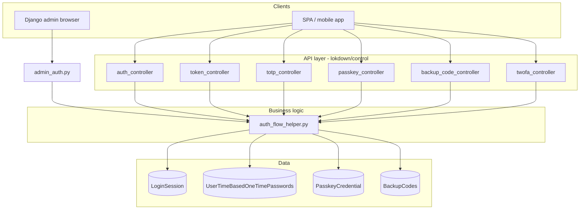
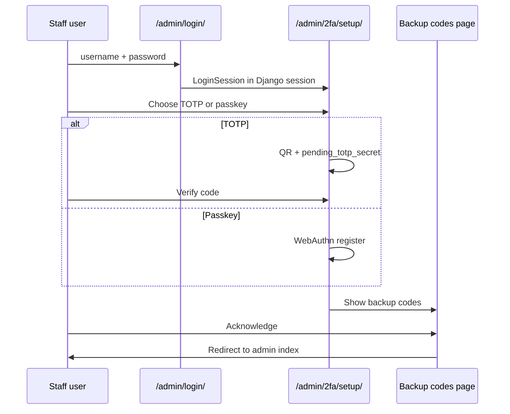

# Lokdown authentication workflow

This document describes how lokdown handles password login, two-factor authentication (2FA), JWT issuance, 2FA enrollment, and Django admin integration after the control-layer refactor.

All business logic lives in `lokdown/helpers/auth_flow_helper.py`. HTTP handlers are thin controllers under `lokdown/control/`. Request and response shapes are defined in `lokdown/serializers/`.

---

## Concepts

### What counts as “2FA enabled”

A user has 2FA enabled when **either** TOTP or at least one passkey is configured:

- TOTP: `UserTimeBasedOneTimePasswords.totp_secret` is set
- Passkey: one or more `PasskeyCredential` rows exist

Backup codes alone do **not** enable 2FA. They are a recovery factor used only after a primary method exists.

### LoginSession

Pending logins (password OK, 2FA not yet done) use a `LoginSession` row:

| Field | Purpose |
|--------|---------|
| `session_id` | Opaque UUID returned to the client |
| `expires_at` | Short-lived (default `TWOFA_SESSION_TIMEOUT` minutes) |
| `requires_2fa` | Always true for these sessions |
| `challenge` | WebAuthn challenge (passkey login or passkey setup) |
| `is_authenticated` | Set true after JWT is issued; blocks reuse |
| `totp_verified` / `passkey_verified` | Set when that factor succeeds (backup does not set these) |

Sessions are single-use for token completion: once `is_authenticated` is true, verification endpoints reject the session.

### Two login stacks (same logic, different response keys)

| Stack | Step 1 | Step 2 | Token JSON keys |
|--------|--------|--------|-----------------|
| **REST login** | `POST /api/auth/login` | `POST /api/auth/verify` | `access_token`, `refresh_token` |
| **SimpleJWT** | `POST /api/auth/token` | `POST /api/auth/token/verify` | `access`, `refresh` |

Both call `initiate_password_login()` and `verify_second_factor()` in `auth_flow_helper.py`.

### Passkey login requires a challenge step

Passkey verification checks `LoginSession.challenge`. Before calling verify:

1. Complete password login → receive `session_id`
2. `POST /api/auth/2fa/passkey/options` with `session_id` → server stores challenge
3. Run WebAuthn `navigator.credentials.get()` in the browser
4. Submit `passkey_response` to verify

---

## Project setup

### `settings.py`

```python
INSTALLED_APPS = [
    # ...
    "lokdown",
    "rest_framework",
    "rest_framework_simplejwt",
    "drf_spectacular",  # optional, for OpenAPI
]

# WebAuthn (required for passkeys)
WEBAUTHN_RP_ID = "localhost"          # fallback rpId; admin/API use request hostname when available
WEBAUTHN_RP_NAME = "My Application"
WEBAUTHN_ORIGINS = [
    "http://localhost:8000",
    "http://127.0.0.1:8000",
]
WEBAUTHN_ORIGIN = "http://localhost:8000"  # optional; first origin if ORIGINS unset

# 2FA behaviour
TWOFA_SESSION_TIMEOUT = 10            # minutes, pending LoginSession lifetime
BACKUP_CODE_RATE_LIMIT = 10           # attempts per IP per minute
BACKUP_CODES_COUNT = 8
BACKUP_CODE_LENGTH = 10
ADMIN_2FA_REQUIRED = True             # custom admin login + 2FA routes
```

### Root `urls.py`

```python
from django.urls import path, include
from lokdown.urls import override_admin_urls

urlpatterns = [
    path("admin/", admin.site.urls),
    path("api/", include("lokdown.urls")),
]

urlpatterns = override_admin_urls(urlpatterns)
```

`override_admin_urls()` replaces the project `admin/` include with lokdown admin routes (2FA login when `ADMIN_2FA_REQUIRED`, plus staff self-service setup URLs).

### Migrations

```bash
python manage.py migrate lokdown
```

---

## Architecture



---

## API workflow: login without 2FA

User has no TOTP secret and no passkeys.

```http
POST /api/auth/login
Content-Type: application/json

{"username": "jane", "password": "secret"}
```

**200 response**

```json
{
  "access_token": "<jwt>",
  "refresh_token": "<jwt>",
  "requires_2fa": false
}
```

Use `Authorization: Bearer <access_token>` on protected routes.

**SimpleJWT equivalent:** `POST /api/auth/token` with the same body returns `access` / `refresh` immediately when 2FA is off.

---

## API workflow: login with 2FA

### Step 1 — Password

```http
POST /api/auth/login
Content-Type: application/json

{"username": "jane", "password": "secret"}
```

**200 response** (2FA required)

```json
{
  "session_id": "550e8400-e29b-41d4-a716-446655440000",
  "requires_2fa": true,
  "totp_enabled": true,
  "passkey_enabled": true,
  "backup_codes_available": true
}
```

Use the flags to show only supported second-factor options in the UI.

**SimpleJWT:** `POST /api/auth/token` returns **401** with the same pre-2FA body when 2FA is required (not an error in the usual sense—check `requires_2fa` in the JSON).

### Step 2a — Complete with TOTP

```http
POST /api/auth/verify
Content-Type: application/json

{
  "session_id": "550e8400-e29b-41d4-a716-446655440000",
  "totp_token": "123456"
}
```

**200 response**

```json
{
  "access_token": "<jwt>",
  "refresh_token": "<jwt>",
  "requires_2fa": false
}
```

### Step 2b — Complete with passkey

**2b.1 — Fetch authentication options**

```http
POST /api/auth/2fa/passkey/options
Content-Type: application/json

{"session_id": "550e8400-e29b-41d4-a716-446655440000"}
```

**200 response** (abbreviated)

```json
{
  "challenge": "<base64>",
  "rp_id": "localhost",
  "timeout": 60000,
  "options": { }
}
```

**2b.2 — Browser WebAuthn** — call `navigator.credentials.get()` using `options` (or challenge/rpId).

**2b.3 — Verify**

```http
POST /api/auth/verify
Content-Type: application/json

{
  "session_id": "550e8400-e29b-41d4-a716-446655440000",
  "passkey_response": { }
}
```

`passkey_response` is the JSON-serialized `PublicKeyCredential` from the browser.

### Step 2c — Complete with backup code

Either include `backup_code` on `POST /api/auth/verify`, or use the dedicated endpoint:

```http
POST /api/auth/2fa/verify/backup
Content-Type: application/json

{
  "session_id": "550e8400-e29b-41d4-a716-446655440000",
  "backup_code": "ABCD1234EF"
}
```

**200 response**

```json
{
  "access_token": "<jwt>",
  "refresh_token": "<jwt>",
  "requires_2fa": false,
  "message": "Backup code verified successfully"
}
```

Backup codes are **single-use**. Failed attempts are logged (`FailedBackupCodeAttempt`) and rate-limited per IP (`BACKUP_CODE_RATE_LIMIT` per minute).

**JWT completion:** Same bodies for step 2, but use `POST /api/auth/token/verify` and expect `access` / `refresh` in the response.

---

## API workflow: enroll 2FA (authenticated user)

All setup endpoints require `Authorization: Bearer <access_token>`. Enrollment applies to **the authenticated user** (no `user_id` in the body).

### Enroll TOTP

**1. Start setup**

```http
POST /api/auth/2fa/setup/totp
Authorization: Bearer <access_token>
```

**200 response**

```json
{
  "secret": "BASE32SECRET",
  "qr_code": "<base64 png>",
  "provisioning_uri": "otpauth://totp/..."
}
```

Show the QR code or provisioning URI. The secret is stored **server-side** as a pending value until verification succeeds.

**2. Confirm**

```http
POST /api/auth/2fa/verify/totp
Authorization: Bearer <access_token>
Content-Type: application/json

{
  "totp_token": "123456"
}
```

**200 response**

```json
{
  "message": "TOTP setup verified successfully",
  "backup_codes": ["ABCD1234EF", "GHI5678JKL0"]
}
```

On success, lokdown saves the secret and generates a **new** set of backup codes. Save them immediately; they are not returned again via the API.

### Enroll passkey

**1. Start registration**

```http
POST /api/auth/2fa/passkey/setup
Authorization: Bearer <access_token>
```

**200 response**

```json
{
  "session_id": "<uuid>",
  "options": { }
}
```

**2. Browser WebAuthn** — `navigator.credentials.create()` with `options`.

**3. Complete registration**

```http
POST /api/auth/2fa/passkey/verify
Authorization: Bearer <access_token>
Content-Type: application/json

{
  "session_id": "<uuid from step 1>",
  "passkey_response": { }
}
```

**200 response**

```json
{
  "message": "Passkey setup verified successfully",
  "backup_codes": ["ABCD1234EF", "GHI5678JKL0"]
}
```

The credential is saved after verification. A fresh set of backup codes is generated and returned in the response (same as TOTP setup). Store them immediately; they are not returned again via the API.

### Manage passkeys

| Method | Path | Auth | Description |
|--------|------|------|-------------|
| GET | `/api/auth/2fa/passkey/credentials` | Yes | List credentials |
| DELETE | `/api/auth/2fa/passkey/remove?credential_id=...` | Yes | Remove one credential |

---

## API workflow: 2FA status and disable

### Status

```http
GET /api/auth/2fa/status
Authorization: Bearer <access_token>
```

**200 response**

```json
{
  "is_enabled": true,
  "totp_enabled": true,
  "passkey_enabled": false
}
```

### Disable all 2FA

```http
POST /api/auth/2fa/disable
Authorization: Bearer <access_token>
```

Clears TOTP secret, deletes all passkeys, and empties backup codes.

---

## Django admin workflow

When `ADMIN_2FA_REQUIRED = True`, staff use lokdown’s admin routes under `/admin/` (via `override_admin_urls`).

### First login (no 2FA configured yet)



| Step | URL | Notes |
|------|-----|--------|
| Login | `/admin/login/` | Password only; creates `LoginSession`, stores `admin_2fa_session_id` in Django session |
| Setup hub | `/admin/2fa/setup/` | Choose TOTP or passkey |
| TOTP setup | `/admin/2fa/verify/totp/` | Secret in session until verified |
| Passkey setup | `/admin/2fa/setup/passkey/` | Uses same helpers as API |
| Backup codes | `/admin/2fa/backup-codes/` | Shown after first enrollment |

### Subsequent logins (2FA already enabled)

| Step | URL | Notes |
|------|-----|--------|
| Login | `/admin/login/` | Password → redirect to verify |
| Verify | `/admin/2fa/verify/` | TOTP, passkey, or backup code |
| Passkey challenge | `POST /api/auth/admin/2fa/passkey/options` | Called from verify template (Django session cookie); stores challenge on `LoginSession` |

On success, Django `login()` runs and `admin_2fa_session_id` is cleared.

### Staff self-service (already logged into admin)

Available even when `ADMIN_2FA_REQUIRED` is false:

| URL | Purpose |
|-----|---------|
| `/admin/current-user/totp-setup/` | Add/replace TOTP |
| `/admin/current-user/passkey-setup/` | Add passkey |
| `/admin/current-user/backup-codes/` | View codes after setup |

---

## Endpoint reference

Base path assumes `path("api/", include("lokdown.urls"))`.

### Authentication

| Method | Path | Auth | Description |
|--------|------|------|-------------|
| POST | `auth/login` | No | Password login → tokens or pre-2FA session |
| POST | `auth/verify` | No | Complete 2FA → `access_token` / `refresh_token` |
| POST | `auth/token` | No | SimpleJWT obtain (same semantics as login) |
| POST | `auth/token/refresh` | No | Refresh JWT |
| POST | `auth/token/verify` | No | Complete 2FA → `access` / `refresh` |

### 2FA enrollment & management

| Method | Path | Auth | Description |
|--------|------|------|-------------|
| POST | `auth/2fa/setup/totp` | Yes | Generate secret + QR |
| POST | `auth/2fa/verify/totp` | Yes | Confirm TOTP + create backup codes |
| POST | `auth/2fa/passkey/setup` | Yes | WebAuthn registration options |
| POST | `auth/2fa/passkey/verify` | Yes | Complete passkey registration |
| POST | `auth/2fa/passkey/options` | No | Passkey auth options (login session) |
| GET | `auth/2fa/passkey/credentials` | Yes | List passkeys |
| DELETE | `auth/2fa/passkey/remove` | Yes | Remove passkey (`?credential_id=`) |
| POST | `auth/2fa/verify/backup` | No | Login with backup code + tokens |
| GET | `auth/2fa/status` | Yes | 2FA status |
| POST | `auth/2fa/disable` | Yes | Remove all 2FA |

### Admin helper (browser)

| Method | Path | Auth | Description |
|--------|------|------|-------------|
| POST | `auth/admin/2fa/passkey/options` | Django session | Challenge for admin passkey verify page |

---

## HTTP status codes (common cases)

| Code | When |
|------|------|
| 200 | Success |
| 400 | Invalid/expired `session_id`, missing fields, passkey without prior options |
| 401 | Bad password, bad 2FA token, SimpleJWT 2FA-required response on `/auth/token` |
| 403 | Not used on login; reserved for future self-only checks |
| 429 | Backup code rate limit exceeded |
| 500 | Failed to create session or generate WebAuthn options |

---

## Security notes

1. **HTTPS in production** — WebAuthn requires a trustworthy origin (`WEBAUTHN_ORIGIN` must match the browser URL).
2. **TOTP secrets at rest** — Encrypted with Fernet. Set `LOKDOWN_FERNET_KEY` (url-safe base64, 32 bytes) in production; otherwise derived from `SECRET_KEY`.
3. **Backup codes at rest** — Stored as salted hashes (Django password hasher). Plaintext codes are returned only once at generation via API/admin session flow.
4. **Session fixation** — `LoginSession` IDs are UUIDs, expire quickly, and cannot be reused after `is_authenticated=True`.
5. **Rate limiting** — Backup verification only (per IP); TOTP/passkey are not rate-limited on `auth/verify` beyond Django/infra limits.
6. **Verification before save** — TOTP secret and passkey credentials are persisted only after a successful verification step.

---

## Client checklist

- [ ] Set `LOKDOWN_FERNET_KEY` in production (generate with `Fernet.generate_key()` from `cryptography`).
- [ ] Include `path("api/", include("lokdown.urls"))` and call `override_admin_urls()`.
- [ ] Branch on `requires_2fa` after password login.
- [ ] For passkey login: call `passkey/options` before `verify`.
- [ ] Store JWT; refresh via `auth/token/refresh`.
- [ ] On 2FA setup: call `setup/totp` then `verify/totp` with only `totp_token` (pending secret is stored server-side).
- [ ] On passkey setup: pass `session_id` from setup into verify.
- [ ] Treat backup codes as single-use; handle 429 on backup attempts.

---

## Internal extension points

To customize behaviour without duplicating controllers:

| Function | Module | Use |
|----------|--------|-----|
| `initiate_password_login` | `auth_flow_helper` | After password auth |
| `verify_second_factor` | `auth_flow_helper` | Second factor during API login |
| `complete_login_with_tokens` | `auth_flow_helper` | Issue JWT after verification |
| `begin_totp_setup` / `complete_totp_setup` | `auth_flow_helper` | TOTP enrollment |
| `begin_passkey_registration` / `complete_passkey_registration` | `auth_flow_helper` | Passkey enrollment |
| `disable_user_2fa` | `auth_flow_helper` | Remove all factors |
| `verify_admin_second_factor` | `auth_flow_helper` | Admin HTML verify |

Serializers in `lokdown/serializers/` define stable OpenAPI schemas for each controller.
